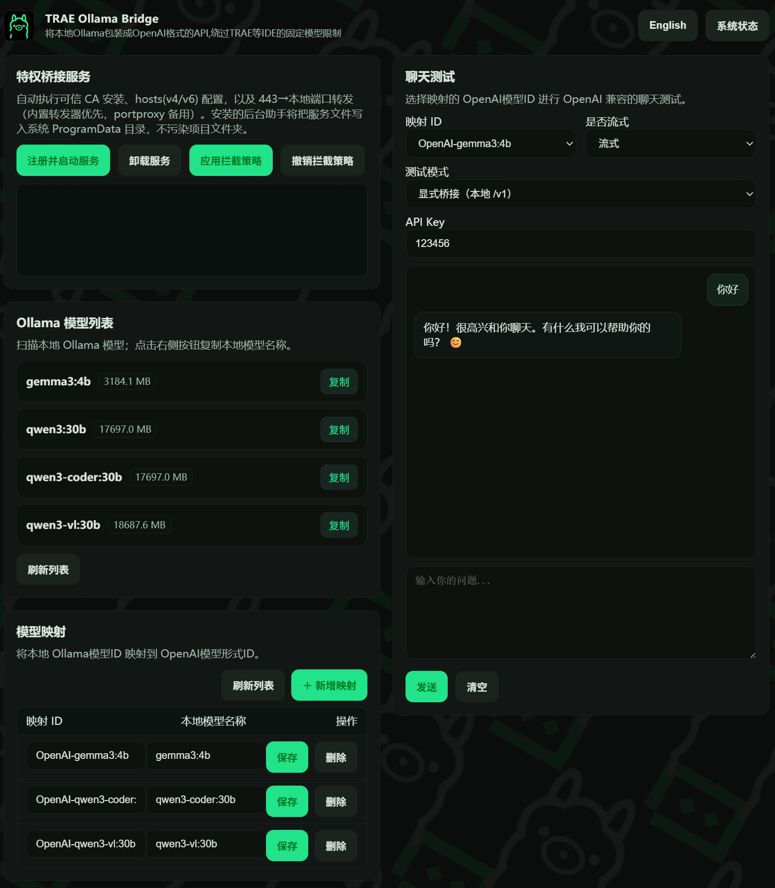
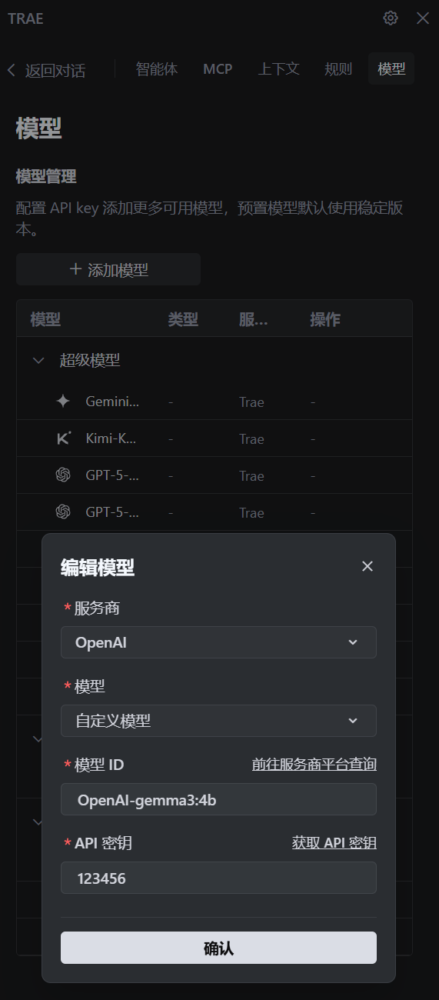
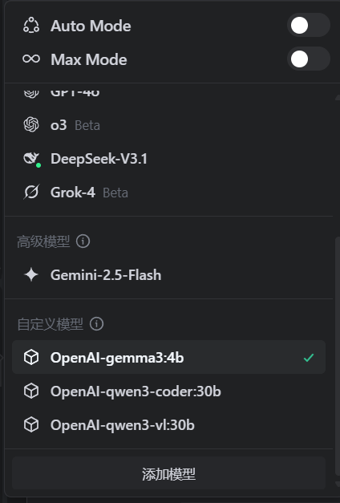

# TRAE-Ollama-Bridge
<picture>
    
</picture>

Atualizado: 2025-11-05 • Versão: latest

> Use modelos locais do Ollama em IDEs que fixam o endpoint da OpenAI (como o TRAE). Esta ponte encapsula o Ollama com uma API compatível com OpenAI e oferece uma Web UI para gerenciar mapeamentos de modelos, testar conversas e, opcionalmente, interceptar `https://api.openai.com` de forma transparente.

## Visão geral
Disponibilize o Ollama local via uma interface compatível com OpenAI para contornar restrições de fornecedor e Base URL em TRAE e IDEs similares. A Web UI gerencia mapeamentos de modelos e fornece um testador de chat. Uma política de interceptação em nível de sistema pode assumir clientes que sempre chamam `https://api.openai.com`.

## Destaques
- Endpoints `/v1` compatíveis com OpenAI: plug-and-play com TRAE e IDEs similares.
- Teste de chat em dois modos: alternância com um clique entre "Explicit Bridge" e "Transparent Interception".
- Validação opcional de chave API: respeita `EXPECTED_API_KEY` e `ACCEPT_ANY_API_KEY`.
- Política de sistema em um clique: emitir/reutilizar CA local e certificado de domínio, escrever `hosts`, configurar 443→porta local.
- Gestão de mapeamentos: associe modelos do Ollama a IDs no estilo OpenAI para seleção fácil nos IDEs.
- Respostas em streaming ou não: simula o comportamento de Chat Completions da OpenAI.
- Prioridade local e privacidade: o tráfego permanece na sua máquina.

## Observações
1. Instale e configure o Ollama previamente e garanta que os modelos necessários funcionem corretamente. Considere aumentar o comprimento de contexto.
2. Copie `.env.example` para `.env` e ajuste os valores conforme seu ambiente.
3. Inicie este projeto antes de configurar o modelo personalizado no Trae IDE.

## Variáveis de ambiente
Consulte `.env.example`:
- `PORT` (padrão `3000`)
- `HTTPS_ENABLED=true|false` (padrão `false`)
- `SSL_CERT_FILE`, `SSL_KEY_FILE` (necessários quando o HTTPS estiver habilitado)
- `OLLAMA_BASE_URL` (padrão `http://127.0.0.1:11434`)
- `EXPECTED_API_KEY` (chave fixa, opcional)
- `ACCEPT_ANY_API_KEY=true|false` (padrão `true`)
- `STRIP_THINK_TAGS=true|false` (remove `<think>...</think>`)
- `ELEVATOR_PORT` (padrão `55055`)

## Início rápido (Windows)
0. Instale Node.js (v18+ recomendado) e npm.
1. Dê duplo clique em `Start-Bridge.bat` para iniciar (na primeira execução, dependências são instaladas automaticamente).
2. O navegador abrirá `http://localhost:PORT/` (padrão `PORT=3000`), exibindo a Web UI.
3. Serviço de ponte privilegiado via Web UI:
   - Clique em "Install & Start Service".
   - Clique em "Apply Intercept Policy".
   - Para desfazer, clique em "Revoke Policy" ou "Uninstall Service".
4. Lista de modelos Ollama na Web UI:
   - Clique em "Refresh" para listar os modelos locais.
   - Clique em "Copy" para copiar o nome do modelo.
5. Mapeamento de modelos na Web UI:
   - Clique em "Refresh" para mostrar os mapeamentos atuais.
   - Clique em "Add Mapping" para adicionar uma nova linha.
     - Em "Local Model Name", informe o nome do modelo local (ex.: `llama2-13b`).
     - Em "Mapping ID", informe o alias global para uso em IDEs (ex.: `OpenAI-llama2-13b`).
   - Clique em "Save" para salvar.
   - Clique em "Delete" para excluir.
6. Teste de chat na Web UI:
   - Selecione "Mapping ID" e "Streaming" ("Streaming" ou "Non-Streaming").
   - Escolha "Test Mode": "Explicit Bridge (/v1, local)" ou "Transparent Interception (https://api.openai.com)".
   - Clique em "System Status" e confirme a exibição "HTTPS: Enabled · hosts: Written" ao testar interceptação transparente.
   - Opcional: informe "API Key". Se `EXPECTED_API_KEY` estiver definido e `ACCEPT_ANY_API_KEY=false`, é obrigatório informar exatamente esse valor.
   - Digite a mensagem e clique em "Send". Se a resposta aparecer, o teste está bem-sucedido.
   - Clique em "Clear" para limpar o chat.

<picture>
    
</picture>

## Configurar o Trae IDE
0. Conclua o Início rápido e verifique o funcionamento do teste de chat.
1. Abra e faça login no Trae IDE.
2. No diálogo de IA, clique em `Configurações (engrenagem) / Modelos / Adicionar modelo`.
3. Provedor: selecione `OpenAI`.
4. Modelo: escolha `Modelo personalizado`.
5. ID do modelo: use o alias definido em `映射ID` da Web UI (ex.: `OpenAI-llama2-13b`).
6. Chave API: qualquer valor funciona por padrão. Se definir `EXPECTED_API_KEY` em `.env`, deve informar exatamente esse valor.
7. Clique em `Adicionar modelo`.
8. No chat, selecione seu modelo personalizado.

<picture>
    
    
</picture>

## Modos de uso
- Interceptação transparente: para clientes que fixam `https://api.openai.com`. O mapeamento 443→PORT em nível de sistema, junto com CA local e certificado de domínio, valida TLS e assume o tráfego.
- Ponte explícita: se o cliente permitir Base URL personalizada, use `http://localhost:PORT/v1` ou `https://localhost:PORT/v1` (com HTTPS habilitado).

## FAQ
- Interceptação transparente falhando?
  - Na Web UI, abra "System Status" e confirme a exibição "HTTPS: Enabled · hosts: Written".
  - No PowerShell, execute `netsh interface portproxy show all` e verifique `0.0.0.0:443 → 127.0.0.1:PORT` ou `::0:443 → ::1:PORT`. Se não houver, clique em "Apply Intercept Policy" na Web UI.
  - Certificados e confiança: instale a CA local em "Trusted Root Certification Authorities" e gere/autorize o certificado de domínio para `api.openai.com` (`certmgr.msc`).
  - Resolução de hosts: verifique `C:\\Windows\\System32\\drivers\\etc\\hosts` para apontar `api.openai.com` localmente (IPv4/IPv6) sem entradas conflitantes.
  - CORS do navegador: se houver alertas de CORS/certificados, teste com "Explicit Bridge" na Web UI ou diretamente no IDE.

- Porta em uso (`EADDRINUSE`)?
  - Altere `PORT` em `.env` para uma porta livre ou encerre o processo ocupante.

- Como funciona a validação da chave API?
  - Com `ACCEPT_ANY_API_KEY=true` (padrão), qualquer chave é aceita.
  - Com `ACCEPT_ANY_API_KEY=false` e `EXPECTED_API_KEY` definido, a requisição deve incluir exatamente essa chave.
  - Informar "API Key" na Web UI envia automaticamente `Authorization: Bearer <key>`.

- Respostas contêm blocos `<think>...</think>`?
  - Defina `STRIP_THINK_TAGS=true` para eliminar `<think>` e obter saída mais limpa no IDE.

## APIs de gerenciamento
- `GET/POST/DELETE /bridge/models`: gerenciar tabela de mapeamentos
- `GET /bridge/ollama/models`: listar modelos locais
- `POST /bridge/setup/https-hosts`: gerar/reutilizar CA local e certificado de domínio, escrever em hosts e configurar 443→PORT
- `POST /bridge/setup/install-elevated-service`: instalar/iniciar serviço auxiliar sem interação
- `POST /bridge/setup/uninstall-elevated-service`: desinstalar o serviço auxiliar
- `GET /bridge/setup/elevated-service-status`: consultar status do serviço auxiliar
- `GET /bridge/setup/status`: verificar status de HTTPS e hosts
- `POST /bridge/setup/revoke`: revogar interceptação (parar encaminhamento/proxy e limpar hosts)

## Licença
MIT (consulte `LICENSE` na raiz).

## Agradecimentos
[Artigo de wkgcass](https://zhuanlan.zhihu.com/p/1901085516268546004) que inspirou este projeto.

---

## Mantenha-se atualizado
Adicione Star e Watch para receber novidades.
> Se este projeto for útil para você, uma estrela é muito bem-vinda!  
> [GitHub: TRAE-Ollama-Bridge](https://github.com/Noyze-AI/TRAE-Ollama-Bridge)